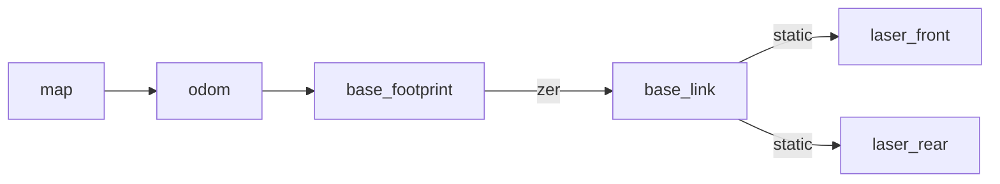

# Second project of the course "Robotics" (A.Y. 2021-2022)

## Students' ID
- 10660258 (Rogora Matteo)
- 10660259 (Grazzani Davide)

---

## Content packages and files description
- `costmap_processing` service to keep track of the robot's path and save it into a png image
- `dynamic_broadcaster` contains a broadcaster to repeat the odometry's topic as a tf transformation
- `ira_laser_tools` package to manage multiple laser scans, for infos refers to its [documentation](https://arxiv.org/abs/1411.1086)
- `path_visualizer` contains script to visualize robot's path in rviz
- `project2` top level package, only contains project's launchfile and rviz config file

---

## TF tree structure:


---

## Bags used
- Map creation tested with all bags, best result with `robotics1_final.bag`
- Map localization tested with all bags

---

## Map creation node
Map is generated using `slam_gmapping` node of the `gmapping` package

---

## How to start-use nodes

- To start the slam environment:
```
roslaunch project2 map_creation.launch
```

- To start the localization environment:\
(To also visualize path in rviz during localization process use the optinoal parameter `view_path`.\
**WARNING**: this option is disabled by default since enabling it at high bag rates compromises computation
```)
roslaunch project2 robot_localization.launch [view_path:=true]
```

- To save the map generated during mapping and localization as a png image use the service:
```
rosrun costmap_processing path_saver.py <path/image_name.png>
```

---

## Additional infos:
- To run localization process a `map_server` must be already running and pubblishing a map
- Map coordinates in the costmap processing are rotated, so the map image result will appear as rotated, this won't affect path drawing on the map